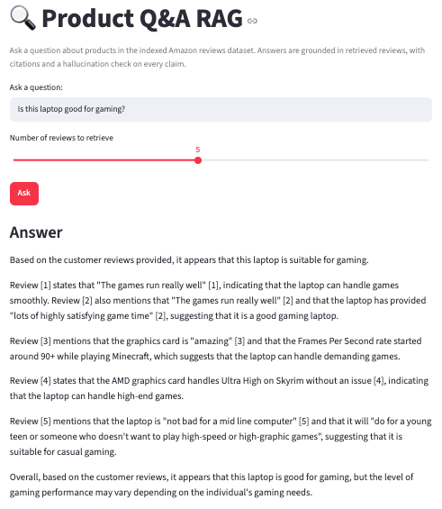
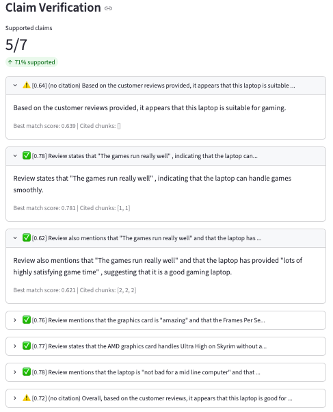
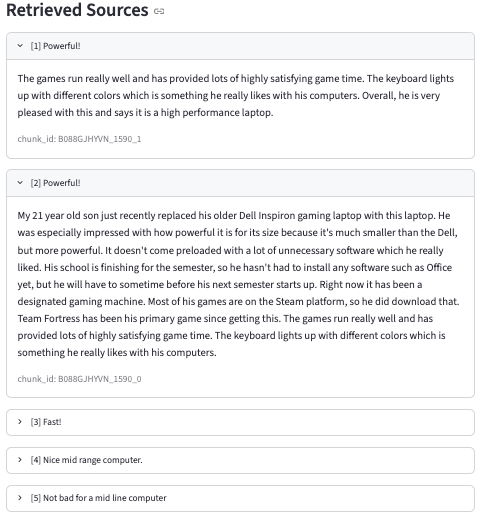

# Product Q&A RAG

A retrieval-augmented Q&A system over Amazon product reviews. Ask a question about a product, and the system retrieves relevant customer reviews, generates a grounded and cited answer, and runs an automated hallucination check on every claim in that answer.



## What this project demonstrates

- End-to-end RAG pipeline: chunking → embedding → retrieval → generation → verification
- Every architectural decision is backed by either real data analysis or documented engineering tradeoffs — not copied defaults
- A citation-aware hallucination verification layer, including a documented, empirically-found limitation in that verification method itself
- A 24-query evaluation set covering easy, medium, hard, and deliberately adversarial ("trap") queries

## Why this project

Built to demonstrate hands-on proof of RAG and LLM-based system design skills, targeting TPM and AI Engineer/Data Scientist roles at e-commerce and logistics companies. Rather than following a tutorial end-to-end, every threshold and design choice below was tuned against real data and documented with reasoning — this README captures that reasoning, including the mistakes and limitations found along the way.

## Architecture

User query
│
▼
retrieve.py ──► Hugging Face Inference API (embeddings) ──► flat NumPy vector store (cosine similarity)
│
▼
generate.py ──► Groq API (llama-3.1-8b-instant) ──► cited, grounded answer
│
▼
verify.py ──► per-claim citation-aware hallucination check

**Data:** [Amazon Reviews 2023](https://huggingface.co/datasets/McAuley-Lab/Amazon-Reviews-2023) (McAuley-Lab), Electronics category, ~2,000-row subset, chunked into ~2,370 retrievable units.

## Key design decisions (and why)

### 1. Length-conditional chunking, not a flat chunk-size rule
Reviews under 150 words are kept as a single chunk; longer reviews are split into sentence-grouped windows with 20% overlap. The threshold wasn't guessed — it came from the actual word-count distribution in this dataset (median 36 words, 75th percentile 79 words, with a long tail up to 1,060 words). Splitting matters because a single long review often covers multiple unrelated topics (e.g. product smell, adapter fit, phone compatibility, and missing instructions all in one review) — embedding that as one chunk would blur the topics together and hurt retrieval precision for any single-topic query.

### 2. Empirically-tuned retrieval threshold
`retrieve.py` filters out chunks below a cosine similarity of **0.45**. This number came from real testing: genuine on-topic queries consistently scored 0.52–0.62, while a deliberately irrelevant test query ("how does this compare to a Tesla") topped out at 0.44. The threshold sits in that gap. Filtering matters directly for hallucination prevention — without it, an off-topic query would still return `top_k` chunks regardless of actual relevance, and the LLM would be handed weak context to answer from rather than admitting it doesn't know.

### 3. Citation-aware verification, not generic best-match checking
`verify.py` checks each generated claim specifically against the chunk(s) it cites, rather than against whichever retrieved chunk happens to match best. This catches **citation misattribution** — a claim that cites source [1] but doesn't actually match [1]'s content closely, even if it happens to resemble some other chunk. A generic best-match-anywhere check would miss this entirely. In testing, this approach caught a real case where the model attributed the same claim to two different chunks — only the correctly-attributed one scored as supported (0.647 vs. 0.389).

### 4. Hardware-driven architecture pivots (documented, not hidden)
Development happened on a 2017 Intel MacBook Pro, 8GB RAM, macOS 12.7.6. Several planned tools weren't installable on this hardware, leading to three deliberate substitutions:

| Originally planned | Actually used | Why |
|---|---|---|
| Ollama (local LLM) | **Groq API** | Ollama requires macOS 14+; this machine's Intel hardware caps out at macOS 13 (Ventura) |
| sentence-transformers (local embeddings) | **Hugging Face Inference API** | PyTorch dropped Intel macOS wheel support after v2.2 — `torch` isn't installable on this machine at all |
| ChromaDB | **Flat NumPy vector store** (custom, `vector_store.py`) | ChromaDB's dependency chain has no pre-built wheels for Python 3.13 on this setup, forcing a failing source build |

Each substitution is a legitimate engineering tradeoff, not a workaround: hosted inference avoids local compute constraints entirely, and a flat NumPy cosine-similarity search is genuinely appropriate at this project's scale (~2,300 vectors) — ChromaDB's approximate-nearest-neighbor indexing is built for a much larger scale (millions of vectors) than this project needs. At significantly larger scale, ChromaDB (or a managed vector DB) would be the right call instead.

## Evaluation

24 test queries across four categories — see [`eval/eval_queries.md`](eval/eval_queries.md) for the full table.

- **100%** of trap (deliberately off-topic) queries correctly handled — either refused at the retrieval stage (similarity threshold filtered all chunks) or refused at generation (model explicitly declined despite weak matches slipping through retrieval). This confirms two independent safety layers, not just one.
- **Found and documented a real limitation in the verification method itself:** honest, appropriately-hedged answers (e.g. "I don't have enough information to compare directly") sometimes score as "unsupported" — not because they're wrong, but because hedging language doesn't closely resemble the terse phrasing of source reviews, diluting cosine similarity. This was verified as inconsistent, not universal (one hedged answer scored 0.75, another scored 0.46), and is documented as a known limitation rather than silently ignored.
- Identified that the retrieval threshold may over-refuse ambiguous-but-technically-answerable queries (all 3 "Hard" category queries were refused at retrieval) — an explicit, acknowledged tradeoff rather than a claimed success.

## Demo



Note: in the run above, 4 of the "unsupported" claims are uncited summary/transition sentences (e.g. "Overall, based on the customer reviews...") — not hallucinations. The verification design requires an explicit citation for a claim to count as supported, which is intentionally strict; see [Known Limitations](#known-limitations) below.



## How to run

### Setup
```bash
python3 -m venv venv
source venv/bin/activate
pip install -r requirements.txt
```

### API keys
Create a `.env` file in the project root:

GROQ_API_KEY=your_groq_key_here
HF_TOKEN=your_huggingface_token_here

### Build the index (one-time)
```bash
python src/ingest.py
python src/embed_index.py
```

### Run via CLI
```bash
python src/app.py
```

### Run via Streamlit UI
```bash
streamlit run src/app_streamlit.py
```

## Project structure

product-qa-rag/
├── src/
│ ├── ingest.py # Load, clean, and chunk review data
│ ├── embed_index.py # Generate embeddings, build vector store
│ ├── vector_store.py # Flat NumPy cosine-similarity vector store
│ ├── retrieve.py # Query the vector store with similarity filtering
│ ├── generate.py # Prompt design + Groq API call
│ ├── verify.py # Citation-aware hallucination verification
│ ├── app.py # CLI entry point
│ └── app_streamlit.py # Streamlit UI
├── eval/
│ ├── eval_queries.md # 24-query evaluation set with manual judgments
│ └── run_eval.py # Script to batch-run the eval query set
├── notebooks/
│ └── EDA.ipynb # Data exploration (chunk length distribution, etc.)
└── data/ # Gitignored — regenerate via ingest.py / embed_index.py

## Known limitations

- **Verification is sentence-level and citation-strict.** Uncited synthesis/summary sentences are always marked unsupported, even when reasonable — this is an intentional strict-checking tradeoff, not a bug, but it means `overall_supported_ratio` reflects citation discipline as much as factual accuracy.
- **Hedging language is inconsistently under-scored.** Cosine similarity between a full claim sentence (including hedge phrasing) and a terse source review can dilute the score even when the underlying fact is accurate. A fix identified but not implemented: compare only the quoted/core portion of a claim to its source, rather than the full sentence.
- **Embedding similarity doesn't catch all hallucination types.** It catches semantic drift and misattribution, but not a claim that combines two individually-true facts into a false implication.
- **Retrieval threshold (0.45) may over-refuse ambiguous queries.** All "Hard" category eval queries were refused rather than answered with appropriate caveats — this threshold favors avoiding false confidence over avoiding false refusals, a deliberate but debatable tradeoff.

## What I'd do with more time

1. Verify only the quoted/core portion of a claim against its source, rather than the full sentence including hedging language
2. Replace cosine-similarity verification with a cross-encoder reranker, or a second LLM call acting as a judge — likely better at distinguishing "appropriately uncertain" from "actually hallucinated"
3. A lower or query-adaptive retrieval threshold to reduce over-refusal on ambiguous-but-answerable queries
4. At larger data scale, migrate from the flat NumPy vector store to a proper ANN-based vector database (e.g. ChromaDB, on a machine where it installs cleanly, or a managed service like Pinecone/Azure AI Search)
5. In production, this architecture would map to Azure OpenAI (generation) + Azure AI Search or a managed vector DB (retrieval) + Azure-hosted embeddings — the current hosted-API approach (Groq + Hugging Face) mirrors that pattern already, just with different providers chosen for free-tier development.

## Tech stack

Python · Groq API (Llama 3.1) · Hugging Face Inference API · sentence-transformers (`all-MiniLM-L6-v2`) · NumPy · pandas · Streamlit